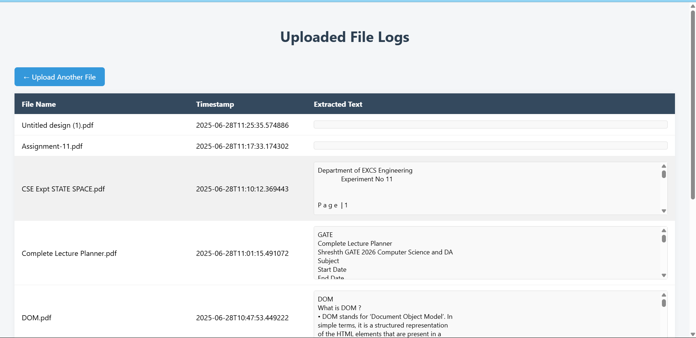
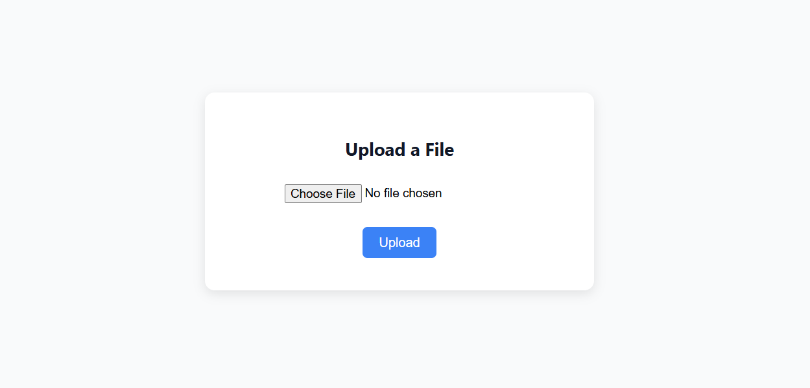

# 📁 Smart Feedback Analyzer

A cloud-native web application built using **Google Cloud Platform (GCP)** and **Flask**, designed to extract and store text from uploaded PDF files and analyze logs in real-time.

---

## 🌐 Live Architecture

- **Frontend**: Flask-based HTML interface
- **Cloud Storage**: Secure PDF file upload
- **Pub/Sub**: Event-driven notification system
- **Cloud Functions**: PDF parsing using `PyMuPDF`
- **Firestore**: Structured log storage
- **Cloud Run**: Scalable backend hosting

---

## 📸 Screenshots

### 🔹 Upload Interface

### 🔹 Log Viewer

---

## 🧠 How It Works

1. **User uploads PDF** via web UI
2. File is stored in a GCS bucket
3. A **Pub/Sub** message is published
4. A **Cloud Function** is triggered
5. Function extracts first 3 pages of PDF text
6. **Log data is saved to Firestore**
7. User can **view logs** via `/logs`

---

## ✅ Features

- 🎯 Real-time PDF upload and processing
- 🔍 Extracted text saved from PDFs (1st 3 pages)
- 🗃️ Log viewer with extracted text preview
- 🌩️ Fully serverless using Cloud Run & Cloud Functions
- 🔐 GCP-auth integrated, scalable, and secure

---

## 🧰 Technologies Used

| Technology | Purpose |
|-----------|---------|
| **Flask** | Frontend + Routing |
| **GCP Cloud Storage** | File Uploads |
| **GCP Pub/Sub** | Event Trigger |
| **Cloud Functions** | PDF Text Extraction |
| **Firestore** | Logging extracted data |
| **Cloud Run** | Hosting the web app |

---

## 📦 Folder Structure

├── app.py
├── Dockerfile
├── requirements.txt
├── templates/
│ ├── index.html
│ └── logs.html
├── cloud-function/
│ └── main.py
└── README.md
